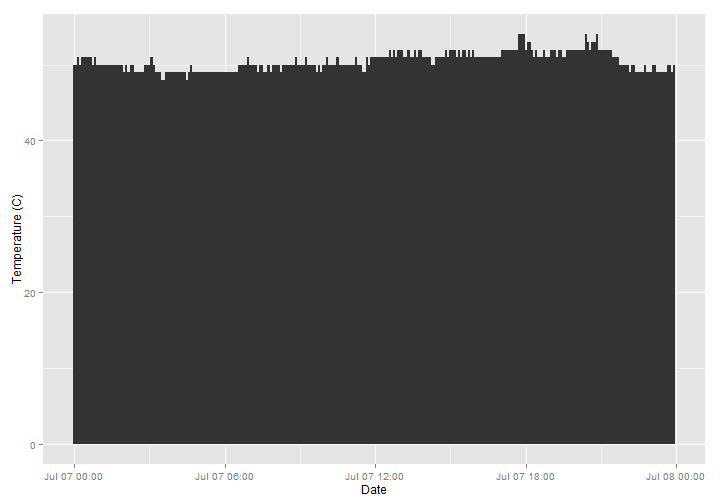
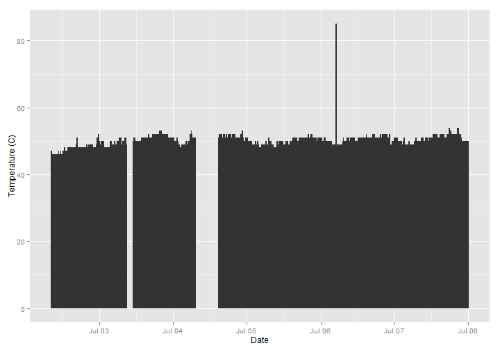
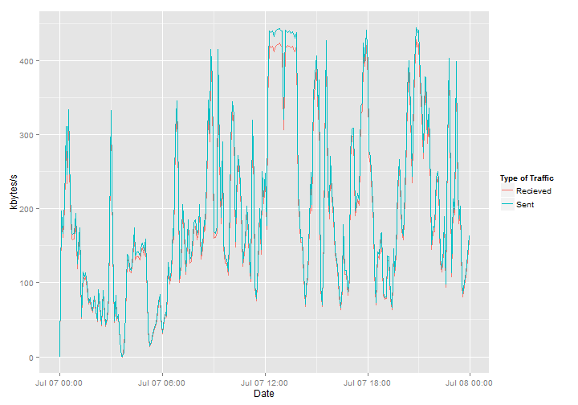
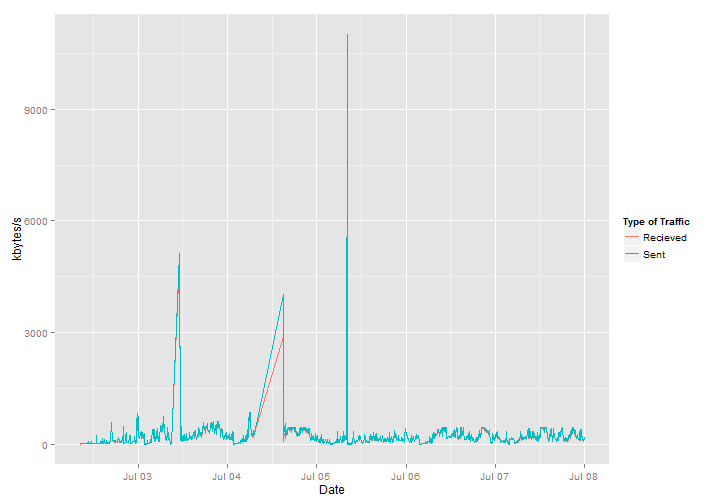

my Raspberry Pi Stats
========================================================

This is a sample document with some graphs about the usage of my Raspberry Pi. It's just for **testing** and there might be many more information to be shown. These are collected via the **cron.sh**. The code is available at [github](https://github.com/ahs85/MonitoR).

CPU load
--------

### Yesterday
 

### Last week
 

Temperature
-----------

### Yesterday
 

### Last week
 

Memory Usage
------------

### Yesterday
 

### Last week
 

Network
-------

As there is no high activity, I added _scale_y_sqrt()_.

### Yesterday
 

### Last week
 

